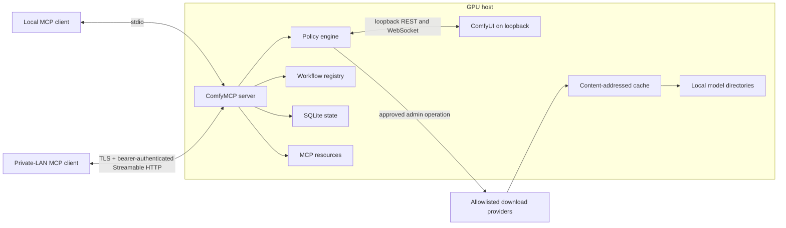
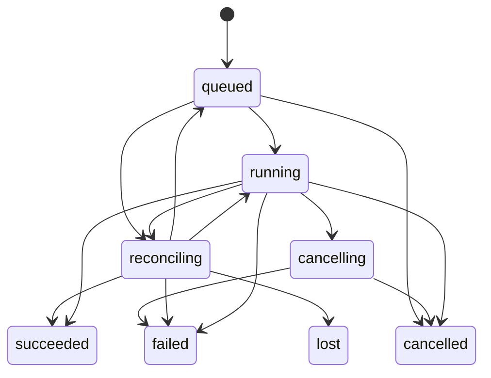

# ComfyMCP Local-Full

## Build-ready project brief

| Field | Decision |
| --- | --- |
| Status | Ready for implementation |
| Brief version | 1.1 |
| Date | 2026-06-30 |
| Product shape | One MCP server co-located with one loopback-only ComfyUI; clients may be local or on an authenticated private LAN |
| Runtime | TypeScript, ESM, Node.js 22 |
| Package and executable | `comfymcp-local` |
| Distribution | npm package with a `comfymcp-local` binary; source install supported |
| Default transport | MCP over stdio |
| Optional transport | TLS-protected, authenticated MCP Streamable HTTP for a private LAN |
| Supported deployment modes | `local_stdio` and `lan_hosted` |
| Inference policy | Local ComfyUI only |
| Network policy | Deny inference egress; allow authenticated LAN ingress and explicit allowlisted administrative downloads |
| Development constraint | No ComfyUI instance is available in this workspace |
| Upstream reference | `artokun/comfyui-mcp` at commit `dc21cc953ea605e98a2ce25d47ef797773784d8c` |

## 1. Executive summary

Build a single MCP server that gives an AI client comprehensive control of a locally installed ComfyUI instance. The server will discover local capabilities, author and run workflows, manage asynchronous jobs and generated assets, install and verify local models, manage custom nodes, expose diagnostics, and optionally control a ComfyUI process. The MCP client may run on the same workstation or on another machine on a private LAN.

All inference must occur in the configured local ComfyUI instance. The core execution path must never fall back to Comfy Cloud, partner providers, hosted API nodes, or other remote inference services. Outbound internet access is permitted only for explicit administrative operations such as downloading models and installing custom-node dependencies. In `lan_hosted`, authenticated MCP traffic is accepted only from configured private-LAN client networks.

For LAN use, ComfyMCP and ComfyUI must run on the same GPU host. ComfyUI remains bound to loopback; only the authenticated ComfyMCP Streamable HTTP endpoint is exposed to the LAN. Running ComfyMCP on one machine and pointing it directly at a different machine's ComfyUI API is not the version 1 full-capability topology.

The implementation will begin as a curated local-focused fork of Artokun's MIT-licensed `comfyui-mcp`, preserving its strongest ComfyUI client, validation, workflow, download, and security work while removing cloud, tunnel, publishing, panel-orchestration, and external-storage features.

Because this development environment has no ComfyUI installation, all initial development and CI will use a deterministic fake ComfyUI REST/WebSocket service. A real ComfyUI integration suite is required before a stable release.

## 2. Problem statement

Existing ComfyUI MCP servers make one of two tradeoffs:

- They are small and easy to understand but support only a fixed image workflow.
- They expose nearly every local, remote, cloud, installation, publishing, and agent feature through one very large authority surface.

The desired product occupies the middle:

- One MCP server and one client configuration.
- Same-machine stdio and secure private-LAN client access.
- Broad local ComfyUI coverage.
- Local model and custom-node installation.
- A compact, coherent tool contract.
- Persistent jobs and asset provenance.
- An enforceable boundary between local inference and network-enabled administration.
- Reliable development without requiring a GPU or ComfyUI in every environment.

## 3. Product definition

### 3.1 Product promise

From one MCP connection, either local or across an authenticated private LAN, an agent can:

1. Determine whether ComfyUI is available and what it can do.
2. Inspect installed nodes, models, extensions, workflows, queue state, history, logs, and VRAM.
3. Create, edit, convert, validate, save, and execute arbitrary API-format workflows.
4. Upload image, video, and audio inputs and stage previous outputs as new inputs.
5. Track progress, cancel work, recover jobs after a restart, and retrieve every output artifact.
6. Search for, plan, download, resume, verify, and remove local model files.
7. Search for, plan, install, update, repair, snapshot, and restore custom-node packs.
8. Start, stop, or restart a configured local ComfyUI process when process ownership can be established safely.

### 3.2 Meaning of “local”

The product uses three separate policy planes:

- **Inference plane:** local-only. ComfyUI requests are limited to one configured local origin. Workflows classified as API-backed, cloud, mixed, or unknown are rejected by default.
- **Administrative download plane:** controlled internet access. Only explicit model or custom-node operations may contact approved providers.
- **Control plane:** stdio on the GPU host or authenticated TLS-protected Streamable HTTP from configured private-LAN clients. This plane carries MCP requests and results; it does not authorize third-party inference.

Downloading a model from Hugging Face or CivitAI is allowed. Sending a prompt, input media, workflow, or generated artifact to a hosted inference provider is not.

“Local” describes where inference, models, workflows, and generated artifacts live; it does not require the MCP client to run on the GPU host. In both supported deployment modes, the ComfyMCP process is co-located with ComfyUI and the configured ComfyUI origin is loopback-only.

### 3.3 Supported deployment modes

| Mode | MCP client | ComfyMCP | ComfyUI | MCP transport |
| --- | --- | --- | --- | --- |
| `local_stdio` | GPU host | GPU host | GPU host, loopback-only | stdio |
| `lan_hosted` | Trusted private-LAN machine | GPU host | Same GPU host, loopback-only | Streamable HTTP over TLS with bearer authentication |

Both modes expose the same capability-driven tool contract. `lan_hosted` changes only the client-to-MCP transport and its security controls; it does not make ComfyUI a remote target.

The following topology is intentionally unsupported in version 1: MCP client and ComfyMCP on machine A, with ComfyMCP pointed at ComfyUI on machine B. Although basic REST execution could work, model installation, custom-node management, filesystem staging, provenance, and safe process control would be incomplete or misleading. A future execution-only remote-ComfyUI profile would require a separate contract and is not implied by this brief.

### 3.4 Primary users

- AI coding assistants that support MCP.
- Local ComfyUI users who want conversational workflow execution and administration.
- Private-LAN users who keep the GPU workstation headless or separate from their MCP client.
- Developers automating image, video, audio, and 3D workflows on a local workstation.
- Teams that need reproducible local assets and model manifests without operating a cloud generation service.

## 4. Goals and non-goals

### 4.1 Goals

- Provide one installable MCP server and one configuration entry.
- Support a default same-machine stdio mode and an opt-in authenticated private-LAN mode.
- Support ComfyUI Desktop and standalone/manual ComfyUI installations.
- Use live discovery instead of hard-coded model, node, or template catalogs.
- Keep inference and primary storage on the GPU host and prohibit third-party media transfer. Authenticated media transfer between the GPU host and an approved LAN client is allowed.
- Support generic workflows rather than only model-specific generation functions.
- Provide first-class model packs and resumable verified downloads.
- Persist jobs, assets, downloads, and provenance across MCP restarts.
- Return prompt IDs immediately and report progress asynchronously.
- Expose all outputs from batches and multi-output workflows.
- Make destructive and networked administration explicit, auditable, and server-gated.
- Run unit, contract, and integration tests without a real ComfyUI instance.
- Be first-class on Windows while remaining portable to Linux and macOS.

### 4.2 Non-goals for version 1

- Comfy Cloud or partner-provider inference.
- Official or third-party API-node execution.
- Pointing ComfyMCP at an arbitrary remote, LAN, VPS, or public ComfyUI origin.
- A publicly reachable MCP endpoint.
- Cloudflare tunnels, internet exposure, a hosted OAuth authorization flow, or multi-tenant/fine-grained authorization.
- S3, Azure Blob, generic HTTP, or hosted artifact publishing.
- An embedded LLM, autonomous agent, prompt rewriter, or model router.
- A ComfyUI sidebar panel.
- A dedicated model-training API. Training remains possible through a user-supplied local workflow.
- Silent installation, removal, or process mutation without administrative enablement.
- Replacing the ComfyUI editor or ComfyUI Manager user interface.

## 5. Implementation strategy

### 5.1 Upstream approach

Use `artokun/comfyui-mcp` commit `dc21cc953ea605e98a2ce25d47ef797773784d8c` as the audited reference baseline.

Begin from the audited commit as a fork, not a wrapper. The first milestone turns it into a curated distribution. Features that violate the product boundary must be removed from compilation and registration, not merely hidden in prompts.

Keep or adapt:

- REST and WebSocket ComfyUI client behavior.
- Workflow execution, validation, UI/API conversion, graph cleanup, and workflow library support.
- Queue, history, error normalization, upload, and output-to-input staging.
- Model hashing, content-addressed download cache, Hugging Face/CivitAI authentication, and path-containment controls.
- Custom-node discovery and local installation primitives.
- Transport-safe logging, Zod schemas, SSRF controls, HTTP authorization/session redaction, and download redaction.
- Unit and integration test patterns.

Remove from the product build:

- Comfy Cloud client and `COMFYUI_API_KEY` mode.
- Partner/API-node generation.
- Cloudflare tunnel support.
- S3, Azure Blob, arbitrary HTTP, and Hugging Face output publishing.
- Registry publishing and custom-node authoring/publishing tools.
- Panel orchestrators and optional Anthropic/Codex agent backends.
- Automatic MCP package or panel update checks.
- Remote-ComfyUI targeting and public tunnel modes. The co-located `lan_hosted` MCP transport remains supported.
- Experimental embedded-agent code.

### 5.2 Upstream maintenance policy

- Preserve MIT license and required attribution.
- Record the baseline commit in `UPSTREAM.md`.
- Import upstream security and ComfyUI compatibility fixes selectively.
- Do not automatically merge upstream feature branches.
- Every imported change must pass the local-inference policy tests.

## 6. Technical architecture



### 6.1 Architectural boundaries

1. **Transport layer** owns MCP stdio framing, Streamable HTTP sessions, LAN authentication and request admission, and transport-safe logging.
2. **Policy engine** authorizes every outbound request, filesystem path, workflow class, and administrative action.
3. **ComfyUI adapter** is the only module allowed to call the configured ComfyUI origin.
4. **Download adapter** is the only module allowed general internet egress, constrained by provider and host allowlists.
5. **Service layer** implements workflows, jobs, assets, models, custom nodes, and process control without depending on MCP request objects.
6. **Persistence layer** owns SQLite migrations and repositories.
7. **MCP layer** translates service results into tools, resources, prompts, progress messages, and structured errors.

### 6.2 Deployment invariant

The ComfyMCP service, its state directory, and every mutable ComfyUI root used by full-capability tools are local to the GPU host. `COMFYMCP_COMFYUI_URL` remains a loopback origin in both modes. The LAN listener is an MCP listener, never a proxy for arbitrary ComfyUI routes.

### 6.3 Runtime stack

- Node.js 22, TypeScript, ESM.
- `@modelcontextprotocol/sdk` for MCP.
- Zod 4 for tool and configuration schemas.
- Native `fetch` for HTTP and `ws` for WebSockets.
- `better-sqlite3` for durable local state.
- YAML parser for model and installation manifests.
- `sharp` only for bounded thumbnail generation and metadata inspection.
- A small subprocess wrapper for allowlisted administrative commands.
- Vitest for unit, contract, and integration testing.

All native dependencies must publish prebuilt binaries for supported Windows, Linux, and macOS targets. If this cannot be guaranteed, the dependency must be optional or replaced.

## 7. Repository layout

```text
comfymcp/
├── src/
│   ├── index.ts
│   ├── cli/
│   │   ├── approve.ts
│   │   └── auth.ts
│   ├── config/
│   │   ├── env.ts
│   │   ├── schema.ts
│   │   └── paths.ts
│   ├── transport/
│   │   ├── stdio.ts
│   │   ├── streamable-http.ts
│   │   ├── http-auth.ts
│   │   ├── http-admission.ts
│   │   ├── http-session.ts
│   │   ├── origin-policy.ts
│   │   ├── tls.ts
│   │   └── logger.ts
│   ├── policy/
│   │   ├── authorization.ts
│   │   ├── network-policy.ts
│   │   ├── path-policy.ts
│   │   ├── workflow-policy.ts
│   │   └── limits.ts
│   ├── comfyui/
│   │   ├── adapter.ts
│   │   ├── rest-client.ts
│   │   ├── websocket-client.ts
│   │   ├── types.ts
│   │   └── errors.ts
│   ├── persistence/
│   │   ├── database.ts
│   │   ├── migrations/
│   │   └── repositories/
│   ├── services/
│   │   ├── system/
│   │   ├── workflows/
│   │   ├── jobs/
│   │   ├── assets/
│   │   ├── models/
│   │   ├── nodes/
│   │   └── downloads/
│   ├── tools/
│   │   ├── system.ts
│   │   ├── workflows.ts
│   │   ├── jobs.ts
│   │   ├── assets.ts
│   │   ├── models.ts
│   │   └── nodes.ts
│   ├── resources/
│   ├── prompts/
│   └── schemas/
├── workflows/
│   ├── manifests/
│   └── examples/
├── model-packs/
├── test/
│   ├── unit/
│   ├── contract/
│   ├── integration/
│   ├── security/
│   ├── fixtures/
│   └── fake-comfyui/
├── docs/
├── scripts/
├── PROJECT_BRIEF.md
├── SECURITY.md
├── UPSTREAM.md
└── package.json
```

## 8. MCP contract

### 8.1 Naming and versioning

- Server name: `comfymcp-local`.
- Tool names use plural domain prefixes: `models_*`, `nodes_*`, `workflows_*`, `jobs_*`, `assets_*`, and `system_*`.
- The initial API version is `v1` and follows semantic versioning.
- Tool removal or incompatible schema changes require a major version.
- Tool descriptions must state whether an operation is read-only, networked, destructive, or administrative.
- MCP tool annotations must be supplied wherever the SDK supports them.
- Inputs and outputs use `snake_case`, JSON Schema, and stable machine-readable error codes.
- List operations use opaque cursor pagination and server-enforced maximum page sizes.
- Every mutating tool accepts an `idempotency_key`. Its uniqueness scope is `(actor_id, tool_name, idempotency_key)`. Reuse with the same normalized input returns the original operation; reuse with different input returns `CONFLICT`.
- ComfyUI origins, provider credentials, allowed hosts, filesystem roots, and maximum limits come only from server configuration, never ordinary tool arguments.
- Tool names, schemas, authorization classes, jobs, resources, and capability discovery are transport-independent. Stdio and Streamable HTTP expose the same inventory for the same host configuration.
- HTTP authentication and admission failures occur before MCP dispatch and use HTTP status codes with bounded generic bodies; tool failures continue to use the structured MCP error envelope.
- When administrative mutations are disabled, administrative apply/delete/process tools are omitted from MCP discovery rather than registered as unusable tools. This is still one server and one configuration entry.
- MCP annotations are descriptive; the policy engine independently enforces permissions, required capabilities, network class, filesystem writes, and confirmation class.

The version 1 HTTP transport targets the MCP `2025-11-25` Streamable HTTP contract. One `/mcp` endpoint implements authenticated `POST`, `GET`/SSE, and `DELETE`; validates `Accept`, `Content-Type`, `MCP-Protocol-Version`, initialization order, and session headers; and authenticates every request independently. A session ID is correlation state, never authentication. Adopting a later MCP protocol revision requires explicit compatibility tests and a documented brief update.

Static bearer credentials are a deliberate private-LAN deployment profile, not a promise of compatibility with every remote MCP client or the full OAuth authorization flow. A client must support a custom `Authorization` header and the pinned Streamable HTTP revision. The operator documentation must list tested clients and their configuration shape.

Stdio calls use the reserved actor ID `local_stdio`. Each LAN client token resolves to an immutable opaque actor ID stored on the GPU host. Actor IDs are used for attribution and mutation scoping, not for tenant-level read isolation.

### 8.2 Tool inventory

The complete version 1 `local-full` contract contains 42 tools when administrative mutations are enabled. User workflows do not become additional MCP tools.

The normal connected, admin-disabled inventory contains 33 tools. It omits `system_control`, `workflows_delete`, `jobs_queue`, `assets_delete`, `models_apply_install`, `models_cancel_download`, `models_remove`, `nodes_apply_change`, and `nodes_snapshots`. Additional capability-dependent omissions are reported by `system_capabilities`: for example, `assets_export` is absent without an export root, and filesystem/process tools are absent without the required roots or owned-process configuration. Contract tests snapshot disconnected, connected-safe, and connected-local-full inventories separately.

#### System tools

| Tool | Purpose | Mutation class |
| --- | --- | --- |
| `system_status` | Connection, versions, sanitized deployment/transport state, logical root availability, devices, VRAM, queue summary, policy mode | Read-only |
| `system_capabilities` | Local node, model, feature, route, and media capability summary | Read-only |
| `system_logs` | Bounded and filtered local ComfyUI/MCP logs | Read-only |
| `system_clear_vram` | Unload cached models through ComfyUI `/free` | Local mutation |
| `system_control` | Start, stop, or restart an owned local ComfyUI process | Administrative |

#### Workflow tools

| Tool | Purpose | Mutation class |
| --- | --- | --- |
| `workflows_list` | Search registered and ComfyUI-library workflows | Read-only |
| `workflows_get` | Read workflow, manifest, dependencies, and provenance | Read-only |
| `workflows_save` | Save an API workflow and optional UI sidecar | Local mutation |
| `workflows_delete` | Delete a registered workflow revision after dependency and revision checks | Destructive administrative |
| `workflows_convert` | Convert UI/API formats with an explicit conversion report | Read-only |
| `workflows_validate` | Static, live-node, model, connection, output, and policy validation | Read-only |
| `workflows_create` | Create an API graph from a local template or explicit nodes | Read-only |
| `workflows_edit` | Apply typed graph operations to a workflow value | Read-only |
| `workflows_run` | Submit a validated local workflow and return a job immediately | Local mutation |

#### Job tools

| Tool | Purpose | Mutation class |
| --- | --- | --- |
| `jobs_list` | Search persistent jobs by status, workflow, date, or label | Read-only |
| `jobs_get` | Return status, progress, errors, outputs, and resource links | Read-only |
| `jobs_cancel` | Delete a pending prompt or interrupt the currently running prompt | Local mutation |
| `jobs_queue` | Administer external/pending prompts: delete selected, clear pending, or interrupt the confirmed running prompt | Administrative |

#### Asset tools

| Tool | Purpose | Mutation class |
| --- | --- | --- |
| `assets_upload` | Validate and upload image, video, audio, mask, or generic input | Local mutation |
| `assets_list` | Search persistent input/output assets | Read-only |
| `assets_get` | Return metadata and an MCP resource or bounded inline preview | Read-only |
| `assets_metadata` | Return complete generation and file provenance | Read-only |
| `assets_stage_as_input` | Copy or upload a generated output into ComfyUI input storage | Local mutation |
| `assets_regenerate` | Re-run the originating workflow with typed overrides | Local mutation |
| `assets_export` | Copy an asset into the configured user export root | Local mutation |
| `assets_delete` | Delete asset content or metadata under retention and dependency rules | Destructive administrative |

#### Model tools

| Tool | Purpose | Mutation class |
| --- | --- | --- |
| `models_list` | List installed local models by ComfyUI folder type | Read-only |
| `models_search` | Search approved model providers | Networked read-only |
| `models_inspect` | Read remote/local metadata, files, hashes, licenses, and compatibility | Networked read-only |
| `models_plan_install` | Resolve a single model or multi-file pack into an immutable plan | Networked read-only |
| `models_apply_install` | Execute an approved install plan | Administrative/networked |
| `models_download_status` | Return bytes, speed, ETA, verification, and destination | Read-only |
| `models_cancel_download` | Stop an active download without exposing a partial model | Administrative |
| `models_verify` | Hash and validate installed files against a manifest | Read-only |
| `models_plan_remove` | Report files, reclaimed space, workflow dependents, and an immutable removal plan | Read-only |
| `models_remove` | Apply an approved removal plan after containment and use checks | Destructive administrative |

#### Custom-node tools

| Tool | Purpose | Mutation class |
| --- | --- | --- |
| `nodes_search` | Search live node classes and approved Registry metadata | Networked/local read-only |
| `nodes_describe` | Return live inputs, outputs, defaults, package, and category | Read-only |
| `nodes_packs` | List installed packs, versions, commits, and dependency health | Read-only |
| `nodes_plan_change` | Plan install, update, remove, repair, or dependency sync | Networked read-only |
| `nodes_apply_change` | Apply a previously approved immutable plan | Administrative/networked |
| `nodes_snapshots` | List, save, or restore custom-node snapshots | Administrative; strongest-action annotation |

#### Critical request schemas

The Zod implementation may add descriptions and derived defaults, but it must preserve these version 1 request shapes.

```ts
type PageInput = {
  cursor?: string;
  limit?: number;
};

type WorkflowRunInput = {
  workflow:
    | { workflow_id: string; version?: string }
    | { api_graph: Record<string, unknown>; manifest?: WorkflowManifest };
  inputs: Record<string, unknown>;
  priority?: "normal" | "front";
  idempotency_key: string;
  limits?: Partial<ExecutionLimits>; // May only tighten server limits.
};

type AssetUploadInput =
  | {
      action: "single";
      source:
        | { kind: "base64"; data: string; mime_type: string }
        | { kind: "resource"; uri: string }
        | { kind: "host_path"; path: string }; // GPU-host import root only.
      target: "input" | "mask" | "registry_only";
      filename?: string;
      idempotency_key: string;
    }
  | {
      action: "begin";
      filename: string;
      mime_type: string;
      total_bytes: number;
      sha256: string;
      target: "input" | "mask" | "registry_only";
      idempotency_key: string;
    }
  | {
      action: "chunk";
      upload_id: string;
      index: number;
      data_base64: string;
      chunk_sha256: string;
      idempotency_key: string;
    }
  | {
      action: "commit" | "cancel";
      upload_id: string;
      idempotency_key: string;
    };

type InstallFile = {
  source_file: string;
  category: string;
  target_name?: string;
  expected_sha256?: string;
};

type ModelInstallRequest =
  | { kind: "pack"; pack_id: string; version?: string }
  | {
      kind: "huggingface";
      repository: string;
      revision: string;
      files: InstallFile[];
    }
  | {
      kind: "civitai";
      model_version_id: number;
      file_ids?: number[];
      category?: string;
    }
  | {
      kind: "direct";
      url: string;
      file: InstallFile & { expected_sha256: string };
    };

type ModelsPlanInstallInput = {
  requests: ModelInstallRequest[];
};

type ModelsApplyInstallInput = {
  plan_id: string;
  accepted_license_ids?: string[];
  idempotency_key: string;
};

type NodesPlanChangeInput = {
  action: "install" | "update" | "remove" | "repair" | "sync_dependencies";
  packages: Array<{
    registry_id?: string;
    repository?: string;
    revision?: string;
  }>;
};

type NodesApplyChangeInput = {
  plan_id: string;
  approval_token: string;
  restart: "never" | "if_required";
  idempotency_key: string;
};

type JobCancelInput = {
  job_id: string;
  idempotency_key: string;
};
```

All path-like values are logical identifiers or jailed GPU-host paths. In `lan_hosted`, a path never refers to the client machine. Model installation destinations are server-configured ComfyUI categories; callers cannot supply arbitrary destination paths. Resource imports accept only this server's `comfymcp://assets/...` URIs. Inline base64 uploads use a separate, substantially smaller limit than jailed host-file imports; larger remote inputs use the staged chunk action.

### 8.3 Required response envelope

Every mutating or long-running tool returns a common envelope:

```json
{
  "ok": true,
  "request_id": "req_01...",
  "job": {
    "job_id": "job_01...",
    "kind": "generation",
    "state": "queued",
    "resource_uri": "comfymcp://jobs/job_01..."
  },
  "summary": "Workflow queued locally",
  "resource_links": [],
  "warnings": [],
  "next_actions": []
}
```

Every call receives a traceable `request_id`. All long-running generation, download, verification, extension-change, and process-control operations additionally use one persisted `job_id`; no separate public download-operation ID exists. Each job has a ULID, actor ID, operation kind, idempotency key, normalized immutable request, state, progress, provider/ComfyUI correlation IDs, ordered event sequence, result, and structured error. ComfyUI `prompt_id` is a nullable downstream correlation value populated only after `/prompt` accepts the graph.

Validation and policy rejection occur before job creation and return an MCP error plus the structured error envelope. Once a job exists, all later failure is represented by its terminal state and error record.

Errors use stable machine-readable codes and preserve relevant ComfyUI node details:

```json
{
  "ok": false,
  "error": {
    "code": "WORKFLOW_POLICY_REJECTED",
    "message": "Workflow contains an API-backed node",
    "retryable": false,
    "node_id": "42",
    "node_type": "ExampleApiNode",
    "details": {}
  }
}
```

Tool failures set MCP `isError: true` and place this envelope in structured content; protocol/transport errors are reserved for malformed MCP communication. The version 1 error-code set is:

`COMFY_UNAVAILABLE`, `CAPABILITY_UNAVAILABLE`, `PERMISSION_DENIED`, `APPROVAL_REQUIRED`, `PLAN_EXPIRED`, `POLICY_VIOLATION`, `INVALID_WORKFLOW`, `MISSING_NODE`, `MISSING_MODEL`, `NOT_FOUND`, `CONFLICT`, `DISK_SPACE`, `DOWNLOAD_AUTH_REQUIRED`, `LICENSE_ACCEPTANCE_REQUIRED`, `CHECKSUM_MISMATCH`, `LIMIT_EXCEEDED`, `TIMEOUT`, `CANCELLED`, `LOST`, and `INTERNAL`.

Codes may gain more detail fields in minor releases but retain their meaning throughout major version 1.

### 8.4 MCP resources

| URI | Content |
| --- | --- |
| `comfymcp://system/capabilities` | Current local capability snapshot |
| `comfymcp://workflows/{workflow_id}` | Workflow manifest and graph metadata |
| `comfymcp://jobs/{job_id}` | Durable job status and provenance |
| `comfymcp://assets/{asset_id}` | Full local artifact with correct MIME type |
| `comfymcp://assets/{asset_id}/chunks/{index}` | Fixed-size chunk for artifacts above the single-resource limit |
| `comfymcp://models/{model_type}/{model_id}` | Installed model metadata |
| `comfymcp://nodes/{class_type}` | Live node schema |

Large workflow JSON and binary artifacts must be resources rather than oversized tool payloads. Inline image previews are capped independently of the full resource. Single-read binary resources are capped at 16 MiB; larger assets publish a manifest with whole-file SHA-256, byte size, 4 MiB chunk URIs, per-chunk SHA-256 values, and chunk count. Authenticated chunk resources are the preferred retrieval path for LAN clients. `assets_export` is the preferred GPU-host path for very large video, audio, archive, and 3D results when the operator wants a local host file.

Internal absolute paths are not exposed through resources or ordinary tool results. An explicitly exported file is the exception: `assets_export` writes beneath `COMFYMCP_EXPORT_ROOT` and may return a clearly labeled `host_path`. A LAN client must not treat that path as client-accessible unless the operator separately mounted the same storage. Asset import accepts inline content, this server's asset resource, a staged chunk upload, or a path contained by an explicitly configured GPU-host input root; it never accepts an arbitrary HTTP URL.

### 8.5 MCP prompts

Ship thin prompts for common flows without adding more action tools:

- `generate-image`
- `generate-video`
- `generate-audio`
- `generate-3d`
- `edit-image`
- `install-model`
- `repair-workflow`

Prompts must direct the agent to discover live workflows, nodes, and models. They must not freeze current model names or node IDs.

### 8.6 Approval policy

MCP annotations and a plan/apply sequence do not, by themselves, prove that a human approved an action.

- Model installs from approved providers may proceed after immutable planning, explicit license acceptance, configured quotas, and administrator enablement.
- Custom-node changes, model removal, workflow deletion, and ComfyUI stop/restart require a single-use local approval token unless an operator has configured a narrower unattended allowlist.
- The packaged CLI provides `comfymcp-local approve <plan_id>` and executes only on the GPU host. The MCP endpoint cannot mint approvals.
- Tools with a dedicated planning tool use its `plan_id`. For `workflows_delete`, `system_control`, and snapshot restore, the first call without an approval token returns `APPROVAL_REQUIRED` and an immutable plan without performing the action; the approved re-call applies that exact plan.
- Plans, approvals, and idempotency records are bound to the initiating `actor_id`. A different actor cannot apply the plan even though all actors belong to one shared operator data domain; a deliberately rotated credential retains the same actor ID.
- Approval tokens are bound to the actor and plan/action digest, expire after ten minutes, are stored only as hashes, and cannot be replayed.
- Applying a changed or expired plan always requires a new plan and approval.
- Unattended policy is configuration-only and cannot be enabled through an MCP tool.

## 9. Workflow model

### 9.1 Executable source of truth

- API-format ComfyUI JSON is the executable source of truth.
- UI-format workflow JSON is an optional editor sidecar.
- UI and API files must never be treated as interchangeable without a conversion report.
- Execution accepts a registered workflow ID or an inline API graph if raw execution is enabled.

### 9.2 Workflow bundle

```text
workflow-name/
├── manifest.yaml
├── workflow.api.json
├── workflow.ui.json        # optional
├── preview.webp            # optional
└── README.md               # optional
```

Example manifest:

```yaml
id: flux-txt2img
version: 1.0.0
media_type: image
entrypoint: workflow.api.json
inputs:
  prompt:
    pointer: /6/inputs/text
    type: string
    required: true
  seed:
    pointer: /3/inputs/seed
    type: integer
    minimum: 0
outputs:
  - node_id: "9"
    kind: image
requires:
  nodes:
    - CheckpointLoaderSimple
    - KSampler
    - SaveImage
  models: []
policy:
  runtime: local
```

The repository must publish a versioned JSON Schema equivalent to this YAML representation. Manifest rules are part of the version 1 contract:

- One input may bind to multiple graph targets.
- Supported input types are `string`, `integer`, `number`, `boolean`, `enum`, `seed`, `image_asset`, `audio_asset`, `video_asset`, and `model`.
- Supported resolvers are fixed built-ins: `literal`, `asset_filename`, and `model_filename`. Scripts and expressions are forbidden.
- Every target declares a JSON Pointer and expected node class; optional expected input type may further constrain it.
- Outputs declare node ID, history field, media kind, `one`/`many` cardinality, and whether an output is required.
- Model sources use provider-specific pinned identifiers and per-file hashes.
- Policy limits may only tighten server limits.
- Workflow IDs are stable. Manifest versions are explicit semantic versions; saved revisions are server-assigned monotonic integers.
- Updates require `expected_revision`; a mismatch returns `CONFLICT` without overwriting.
- Omitting a version from `workflows_get` or `workflows_run` resolves the highest non-prerelease semantic version, then its latest revision.
- UI-to-API conversion is supported with a conversion report. API-to-UI reconstruction is explicitly best-effort and lossy; it must never be labeled a round trip.

### 9.3 Validation pipeline

Validation runs in this order:

1. JSON parsing and size limits.
2. API/UI format detection.
3. Manifest and typed binding validation.
4. Node ID, link, output-index, and cycle checks.
5. Required input checks.
6. Live node schema checks through `/object_info`.
7. Local model and custom-node dependency checks.
8. Output/save-node checks.
9. Runtime classification: `local`, `api`, `mixed`, or `unknown`.
10. Policy decision and actionable error report.
11. ComfyUI submission-time validation and preservation of returned `node_errors`.

`api`, `mixed`, and `unknown` workflows are rejected by default. Unknown may be enabled only by an explicit administrator policy and is never silently treated as local.

## 10. Job model

### 10.1 State machine



The canonical job states are `queued`, `running`, `cancelling`, `reconciling`, `succeeded`, `failed`, `cancelled`, and `lost`. Terminal states are `succeeded`, `failed`, `cancelled`, and `lost`.

### 10.2 Execution behavior

- `workflows_run` returns a durable `job_id` without waiting for completion. Its `prompt_id` may initially be null and is recorded after ComfyUI accepts the graph.
- A WebSocket watcher consumes execution, progress, completion, and error events.
- `/history/{prompt_id}` polling is the fallback and restart-reconciliation mechanism.
- MCP clients obtain authoritative progress by polling `jobs_get`. Clients that subscribe to resources also receive `resources/updated` notifications for `comfymcp://jobs/{job_id}`; the server does not claim request-scoped MCP progress after `workflows_run` has returned.
- `lan_hosted` uses authenticated stateful Streamable HTTP GET/SSE for notifications. Every event has a session-unique monotonic ID; the server retains the latest 1,000 events or 15 minutes, whichever is smaller, for bounded `Last-Event-ID` replay. Streams and replay buffers are actor/session-isolated. If the requested event is no longer retained, notifications remain best-effort and the client recovers through `jobs_get`.
- Progress includes current node, current step, total steps, percentage, elapsed time, and estimated remaining time when available.
- All terminal output records are stored before the job becomes `succeeded`.
- Pending cancellation uses `/queue` deletion.
- Running cancellation calls `/interrupt` only after confirming the requested prompt is the currently running prompt.
- A global ComfyUI interrupt must never be presented as prompt-scoped when it is not.
- `jobs_cancel` operates only on MCP-owned jobs. `jobs_queue` is the separately annotated administrative escape hatch for `delete_pending`, `clear_pending`, and `interrupt_running` against external ComfyUI prompts.
- Queue reordering is not supported in version 1; submission priority may request the ComfyUI front-of-queue behavior without replacing prompt IDs.

### 10.3 Restart reconciliation

At startup:

1. Mark unfinished jobs `reconciling`.
2. Read `/queue` and relevant `/history` records.
3. Reattach watchers to queued/running prompts.
4. Finalize jobs found in history.
5. Mark unresolvable jobs `lost` with an explanation; never leave them indefinitely `running`.

## 11. Asset and provenance model

Every output from every output node becomes an asset record. An asset contains:

- Stable local `asset_id`.
- Job, prompt, workflow, and output-node IDs.
- ComfyUI filename, subfolder, and storage type.
- MIME type, byte size, dimensions, duration, and media kind when available.
- SHA-256 content hash.
- Exact submitted API graph and typed input values.
- Workflow and manifest hashes.
- Referenced models, LoRAs, VAEs, and custom-node versions where discoverable.
- ComfyUI history and normalized error/timing data.
- Creation time, retention policy, and local resource URI.

Asset records persist across MCP restarts. Missing files remain visible with state `missing`; their provenance must not disappear.

Supported artifact classes include image, video, audio, mask, latent preview, text, archive, 3D model, material/texture, and generic file.

### 11.1 Large media and lifecycle

- Inline base64 upload is capped at 16 MiB. Larger same-host inputs may use a jailed GPU-host path; larger LAN inputs use the `assets_upload` staged chunk actions.
- `begin` declares the sanitized filename, MIME type, exact byte count, whole-file SHA-256, and target. Admission checks per-file, per-actor, staging-quota, and free-space limits before returning an `upload_id`, fixed 4 MiB chunk size, expected chunk count, and expiry.
- The `upload_id` is unguessable and bound to the initiating actor. Chunks may arrive in any order; each carries its index and SHA-256. An exact duplicate is idempotent, while conflicting content for an existing index returns `CONFLICT`.
- `commit` succeeds only when every index is present, individual hashes match, the assembled byte count and whole-file hash match, and the target capability is available. The verified file is atomically activated and registered; failures expose no partial input to ComfyUI.
- `cancel`, actor revocation, or the default 60-minute expiry removes staged chunks. A startup sweeper removes expired orphan staging records and files. At most four staged uploads per actor and 20 GiB of global staging are active by default.
- Images and masks use ComfyUI upload routes when advertised.
- Video and audio use discovered upload routes when available; otherwise they require `COMFYMCP_COMFYUI_PATH` or an explicit ComfyUI input-directory mapping for jailed filesystem staging.
- Generic and 3D input staging is capability-reported and unavailable unless a compatible node/route or input mapping exists.
- Output files remain ComfyUI-owned and are never garbage-collected automatically by the MCP server.
- MCP-generated previews and download cache use configurable size-bounded LRU cleanup.
- Temporary input staging defaults to seven-day retention unless a registered workflow or asset record still references it.
- Provenance records remain after missing or deleted content and may be pruned only through configured metadata-retention policy.
- `assets_delete` removes registry/previews by default. `delete_content=true` requires administrative enablement, approval, dependency checks, and path containment.
- Files under the user export root are user-owned and never automatically deleted.
- Assets and resources are shared within the configured single-operator trust domain; version 1 does not claim per-user media privacy. Notifications and temporary upload state remain isolated by actor/session to prevent accidental cross-client delivery.

## 12. Model management

### 12.1 Supported version 1 providers

- Hugging Face.
- CivitAI.
- Direct HTTPS only when explicitly enabled and accompanied by an expected checksum.

Comfy Registry is used for custom-node metadata, not model inference.

### 12.2 Installation planning

`models_plan_install` resolves a model or pack into an immutable, expiring plan containing:

- Provider and canonical source identifiers.
- Revision or version.
- Every required file.
- File sizes and total size.
- Expected hashes when supplied by the provider or manifest.
- License and gated-access requirements.
- Destination ComfyUI model directories.
- Existing matching files and cache hits.
- Required free disk space.
- Name collisions or overwrite decisions.
- A human-readable summary.
- `plan_id`, hash, creation time, and expiry.

`models_apply_install` accepts only the unmodified `plan_id`. Changes require a new plan.

`models_plan_remove` performs the equivalent dependency, containment, reclaimed-space, and collision analysis for deletion. `models_remove` accepts only that immutable removal plan and must move files to quarantine before permanent cleanup.

Every planned file records one verification level:

- `trusted_hash`: an expected SHA-256 comes from a pinned model pack, provider content identifier, or trusted provider metadata.
- `operator_hash`: an expected SHA-256 was supplied through an administrator-approved direct-download policy.
- `calculated_only`: the server can detect later corruption but cannot prove the downloaded bytes match a previously trusted value.

Stable model packs and direct downloads require `trusted_hash` or `operator_hash`. `calculated_only` installation is rejected by default and can be enabled only through unsafe administrator policy and a one-time approval.

### 12.3 Download requirements

- Stream downloads; do not buffer complete models in memory.
- Support HTTP range-based resume where providers permit it.
- Write to a `.part` file in the destination filesystem.
- Verify declared size and the per-file expected checksum before exposure to ComfyUI; record calculated hashes even when stronger verification is unavailable.
- Rename atomically after verification.
- Keep a content-addressed cache keyed by SHA-256.
- Coalesce concurrent requests for the same artifact.
- Report bytes, speed, ETA, retries, and verification state.
- On cancellation or failure, never expose the partial file under its final name.
- Redact access tokens and signed query values from logs and errors.
- Reject archive traversal, symlinks escaping the destination, device paths, and reserved Windows filenames.
- Prefer `safetensors`. Pickle-capable model formats are disabled by default and require an explicit unsafe-format administrator policy.
- Revalidate the approved host, resolved address, response size, and redirect destination on every network hop.

### 12.4 Model packs

A model pack is a declarative manifest that can install all files required by a workflow, including checkpoints or diffusion models, text encoders, VAEs, ControlNets, LoRAs, upscale models, and auxiliary weights.

Packs must be data, not executable scripts. They include URLs/provider IDs, destinations, hashes, sizes, licenses, and compatible workflow IDs.

## 13. Custom-node management

Custom-node operations are more dangerous than model downloads because they install executable code.

Requirements:

- Administrative mutations are disabled unless explicitly enabled at startup.
- Every change begins with `nodes_plan_change`.
- Plans show repository, revision, files changed, Python/Node dependencies, commands, restart requirement, and rollback snapshot.
- Registry IDs or allowlisted Git hosts are preferred over arbitrary repository URLs.
- Clone/update operations use fixed argument arrays, never shell-interpolated strings.
- Dependency installation is constrained to the target ComfyUI environment and recorded in the audit log.
- A snapshot is created before update, removal, repair, or dependency synchronization.
- Failed operations attempt rollback and report partial state precisely.
- Newly installed code is not trusted merely because it came from the Comfy Registry.
- Downloads and archive extraction occur in an isolated staging directory with file-count, expanded-size, traversal, symlink, and decompression-ratio limits.
- Git hooks are disabled. Registry releases or immutable Git commits are preferred; moving branches are not accepted as install-plan identities.
- Remote/VCS dependency specifications, source-built packages, and arbitrary install scripts are denied by default unless a separate administrator policy explicitly allows them.

## 14. Security requirements

### 14.1 Threats in scope

- Prompt injection attempting to invoke administrative tools.
- A malicious or malformed workflow using hosted/API nodes.
- SSRF through URLs, redirects, DNS rebinding, or provider metadata.
- Path traversal, symlink escape, Windows device paths, or unsafe archive entries.
- Untrusted model or custom-node supply chains.
- Oversized workflows, uploads, previews, logs, or tool responses causing resource exhaustion.
- An unauthenticated, plaintext, publicly bound, DNS-rebindable, or session-hijackable MCP listener reached through a browser or another process.
- A hostile or compromised LAN peer scanning the MCP endpoint, stealing or replaying a token, intercepting cleartext traffic, or exhausting sessions.
- DNS rebinding, hostile `Host` or `Origin` values, and spoofed forwarding headers at a reverse-proxy boundary.
- Secrets appearing in logs, SQLite, tool responses, child-process arguments, or crash reports.
- Cancelling the wrong running workflow through ComfyUI's global interrupt.
- Partial downloads or interrupted installs appearing valid.

### 14.2 Mandatory controls

- Exactly one transport runs per process. Stdio is the default, is never implicitly upgraded to HTTP, and opens no listening socket. Stdout is reserved exclusively for MCP protocol frames; in either mode logs go to stderr or the configured service log and never enter protocol frames, HTTP responses, or SSE events.
- Streamable HTTP is the only version 1 network transport. It exists solely for the co-located `lan_hosted` topology and serves MCP at `/mcp`; it never exposes, forwards, or mirrors arbitrary ComfyUI routes.
- A non-loopback listener requires all of the following at startup: an explicit private unicast bind address, TLS, bearer authentication, at least one allowed client CIDR, and an exact `Host` allowlist. Wildcard and globally routable bind addresses are rejected in version 1.
- TLS is either native to ComfyMCP or terminated by a specifically configured trusted reverse proxy on the same GPU host. Native TLS permits TLS 1.2 and 1.3 only. In trusted-proxy mode, ComfyMCP binds only to loopback, accepts forwarding headers only from configured proxy CIDRs, requires exactly one RFC 7239 `Forwarded` element with `proto=https`, ignores `X-Forwarded-*`, and rejects missing or multi-hop forwarding metadata. The proxy must overwrite, not append to, client-supplied forwarding headers and preserve the external `Host` value.
- Bearer secrets contain at least 256 bits of randomness and are accepted only in the `Authorization: Bearer` header, never a URL, cookie, tool argument, or committed config. The GPU-host CLI supports `auth create`, `auth list`, `auth rotate`, and `auth revoke`; plaintext is shown only at creation/rotation, while SQLite stores token ID, immutable actor ID, SHA-256 secret hash, timestamps, label, and revocation state. Verification is constant-time.
- Token rotation creates a replacement secret for the same actor before revoking the old token. Revocation takes effect on the next request without a server restart and closes sessions/SSE streams belonging to that token. Plans remain actor-bound across a deliberate rotation but are unusable by another actor.
- Version 1 has per-client actor IDs for attribution and safety but one operator data trust domain, not multi-user authorization or tenant isolation. Every authenticated actor can read the same discovered tools, jobs, workflows, and assets. Possession of a bearer token does not bypass administrative enablement, immutable plans, local approval, or unattended-action policy.
- Every MCP `POST`, SSE `GET`, session `DELETE`, tool call, prompt read, resource read, and chunk transfer is authenticated. Requests are admitted only when the effective client address is inside `COMFYMCP_HTTP_ALLOWED_CLIENT_CIDRS`. `Host` must match the exact allowlist and advertised URL. A present `Origin` must exactly match the origin allowlist; `Origin: null` and wildcard CORS are rejected. If no origins are configured, every request containing `Origin` is rejected. Missing `Origin` remains valid for non-browser MCP clients.
- Browser preflight is optional and inert: `OPTIONS /mcp` is handled before MCP dispatch, only for an admitted client/Host and exactly allowed Origin, and returns fixed methods/headers with no credentials or capability data. When no browser origins are configured, `OPTIONS` is rejected. Cookies and `Access-Control-Allow-Origin: *` are never used.
- HTTP headers and bodies, open connections, new sessions, SSE streams, authentication failures, and requests per effective client/actor are bounded before expensive parsing. Authentication failures, malformed session IDs, and rate-limit failures return generic responses without capability, path, version, or token details.
- Streamable HTTP session identifiers are cryptographically random, bound to the authenticated actor and token, expire after the configured idle timeout, and cannot be supplied under another credential. A successful authenticated `DELETE` closes the session and its streams.
- The configured ComfyUI URL must resolve to loopback and match the configured origin exactly in both deployment modes.
- Redirects from the ComfyUI origin are rejected.
- New outbound connections are limited to the ComfyUI adapter's configured loopback origin and the administrative download adapter's approved provider hosts. The MCP transport only responds on authenticated inbound connections.
- Download providers and redirect targets are allowlisted and revalidated.
- Workflow, model, input, output, cache, and custom-node paths use canonical containment checks.
- Filesystem roots are explicit; no recursive home-directory discovery.
- Administrative mutations require startup enablement. Model install/removal and custom-node changes additionally require a valid immutable plan; workflow deletion, snapshot restore, and ComfyUI stop/restart require an equivalent approval-bound action plan.
- Destructive tools use destructive MCP annotations, server-enforced approval, containment checks, and quarantine or rollback where applicable.
- The policy engine classifies every workflow before submission.
- Official API nodes are disabled in the target ComfyUI configuration where supported.
- Deployments seeking a hard guarantee must block egress from the ComfyUI process/container; custom nodes are executable code.
- `system_status` reports `locality_assurance` as `policy_only`, `operator_attested`, or `container_verified`. The server must never label policy scanning or operator attestation as verified egress enforcement.
- If the operator configures `require_egress_enforcement`, generation is refused until the deployment's no-egress check is verified.
- Provider credentials are accepted through environment variables or OS credential facilities, never committed config files. MCP bearer plaintext is never persisted by the server.
- Secrets are redacted before logs, errors, persistence, and MCP results.
- Bearer values, authorization headers, session IDs, TLS-key paths, provider tokens, and approval tokens are always redacted; access logs never include prompts or media bodies.
- Tool parameters and responses have hard size and count limits.
- SQLite uses parameterized queries and controlled migrations.
- The service runs under a dedicated least-privileged host account. State, token records, TLS keys, model roots, and custom-node roots use restrictive host ACLs; Windows deployment guidance limits the MCP firewall rule to the Private profile and configured client CIDRs and never opens the ComfyUI port.
- Audit events are append-only through normal application APIs and include actor ID, token ID hash, transport, request ID, effective source address, session ID hash, tool/action, plan ID, and outcome without storing secrets.

For HTTP admission failures, the fixed status contract is: `400` malformed request or session metadata, `401` missing/invalid bearer token with `WWW-Authenticate: Bearer`, `403` disallowed client/host/origin, `413` oversized body, `429` rate or connection admission exceeded, and `503` server draining or unavailable. These responses are JSON, have a 4 KiB maximum, use a correlation ID, and disclose no tool inventory or configuration details.

### 14.3 Default limits

Defaults are configurable downward or upward by an administrator, but never per ordinary tool call.

| Limit | Default |
| --- | --- |
| Workflow JSON | 5 MiB |
| Input upload | 500 MiB |
| Inline preview | 512 KiB encoded |
| Log response | 256 KiB |
| Batch size | 16 |
| Image width/height | 16,384 pixels |
| Sampling steps | 1,000 |
| Simultaneous downloads | 3 |
| Workflow execution timeout | 60 minutes |
| Download retry count | 4 |
| Plan lifetime | 30 minutes |

## 15. Configuration

No environment variables are required to start the MCP server in disconnected/read-only `local_stdio` mode. A typical fully managed same-machine deployment sets:

```text
COMFYMCP_COMFYUI_URL=http://127.0.0.1:8188
COMFYMCP_COMFYUI_PATH=C:\path\to\ComfyUI
COMFYMCP_STATE_DIR=C:\path\to\comfymcp-state
COMFYMCP_EXPORT_ROOT=C:\path\to\exports
```

Before enabling `lan_hosted`, the operator runs `comfymcp-local auth create --label <client-name>` on the GPU host and securely copies the one-time plaintext token to that client. An opt-in native-TLS deployment then sets values equivalent to:

```text
COMFYMCP_TRANSPORT=streamable_http
COMFYMCP_HTTP_BIND=192.168.1.50
COMFYMCP_HTTP_PORT=9100
COMFYMCP_HTTP_ADVERTISED_URL=https://comfy-gpu.lan:9100/mcp
COMFYMCP_HTTP_TLS_MODE=native
COMFYMCP_HTTP_TLS_CERT=C:\path\to\tls\comfy-gpu.crt
COMFYMCP_HTTP_TLS_KEY=C:\path\to\tls\comfy-gpu.key
COMFYMCP_HTTP_ALLOWED_CLIENT_CIDRS=192.168.1.0/24
COMFYMCP_HTTP_ALLOWED_HOSTS=comfy-gpu.lan:9100
COMFYMCP_COMFYUI_URL=http://127.0.0.1:8188
```

The equivalent reverse-proxy deployment binds ComfyMCP's Streamable HTTP listener to loopback, sets `COMFYMCP_HTTP_TLS_MODE=trusted_proxy`, identifies only the local proxy in `COMFYMCP_HTTP_TRUSTED_PROXY_CIDRS`, and terminates LAN TLS at that proxy. Bearer authentication remains enforced by ComfyMCP.

Important settings:

| Setting | Default | Purpose |
| --- | --- | --- |
| `COMFYMCP_TRANSPORT` | `stdio` | `stdio` or `streamable_http`; HTTP is opt-in |
| `COMFYMCP_HTTP_BIND` | `127.0.0.1` | Exact listener address; non-loopback must be private unicast and never wildcard |
| `COMFYMCP_HTTP_PORT` | `9100` | Streamable HTTP listener port |
| `COMFYMCP_HTTP_PATH` | `/mcp` | Fixed MCP endpoint path |
| `COMFYMCP_HTTP_ADVERTISED_URL` | unset | Required external HTTPS `/mcp` URL for Host, path, and certificate validation |
| `COMFYMCP_HTTP_TLS_MODE` | unset | Required for `lan_hosted`: `native` or `trusted_proxy` |
| `COMFYMCP_HTTP_TLS_CERT` | unset | PEM certificate for native TLS |
| `COMFYMCP_HTTP_TLS_KEY` | unset | PEM private key for native TLS; secret and ACL-restricted |
| `COMFYMCP_HTTP_ALLOWED_CLIENT_CIDRS` | empty | Required client source ranges for `lan_hosted` |
| `COMFYMCP_HTTP_ALLOWED_HOSTS` | empty | Required exact `Host` values, including port when present |
| `COMFYMCP_HTTP_ALLOWED_ORIGINS` | empty | Exact browser origins; empty rejects every request that supplies `Origin` |
| `COMFYMCP_HTTP_TRUSTED_PROXY_CIDRS` | empty | Forwarding-header authorities; permitted only with loopback bind in `trusted_proxy` mode |
| `COMFYMCP_HTTP_RATE_LIMIT_PER_MINUTE` | `120` | Per-effective-client admission limit |
| `COMFYMCP_HTTP_AUTH_FAILURES_PER_MINUTE` | `10` | Per-effective-client failed-authentication limit |
| `COMFYMCP_HTTP_MAX_HEADER_BYTES` | 32 KiB | Aggregate HTTP-header cap before MCP parsing |
| `COMFYMCP_HTTP_MAX_CONNECTIONS` | `32` | Global open HTTP connection limit |
| `COMFYMCP_HTTP_MAX_SESSIONS` | `16` | Global active Streamable HTTP session limit |
| `COMFYMCP_HTTP_MAX_SESSIONS_PER_ACTOR` | `8` | Active session cap for one actor |
| `COMFYMCP_HTTP_MAX_SSE_STREAMS_PER_ACTOR` | `4` | Concurrent notification-stream cap for one actor |
| `COMFYMCP_HTTP_MAX_BODY_BYTES` | 20 MiB | MCP HTTP body cap, sized above the default inline-upload limit |
| `COMFYMCP_HTTP_SESSION_IDLE_MINUTES` | `30` | Idle expiry for stateful MCP sessions |
| `COMFYMCP_COMFYUI_URL` | `http://127.0.0.1:8188` | Exact local ComfyUI origin |
| `COMFYMCP_COMFYUI_PATH` | unset | Required for filesystem and process tools |
| `COMFYMCP_STATE_DIR` | platform application-data directory | SQLite, cache metadata, and audit data |
| `COMFYMCP_WORKFLOW_ROOT` | state-dir workflows | Registered workflow bundles |
| `COMFYMCP_INPUT_ROOTS` | empty | GPU-host files the upload tool may read; never client paths |
| `COMFYMCP_EXPORT_ROOT` | unset | GPU-host destination for `assets_export` |
| `COMFYMCP_COMFYUI_INPUT_ROOT` | derived when possible | Jailed staging root for media lacking upload routes |
| `COMFYMCP_COMFYUI_OUTPUT_ROOT` | derived when possible | Jailed output root used only for verified local files |
| `COMFYMCP_MODEL_ROOTS_FILE` | derived when possible | Explicit mapping of ComfyUI model categories to roots |
| `COMFYMCP_CUSTOM_NODES_ROOT` | derived when possible | Required for custom-node mutation tools |
| `COMFYMCP_ADMIN_MUTATIONS` | `false` | Enables plan/apply administrative tools |
| `COMFYMCP_ALLOWED_MODEL_HOSTS` | provider defaults | Download host allowlist |
| `COMFYMCP_ALLOW_DIRECT_DOWNLOADS` | `false` | Enables checksummed direct HTTPS models |
| `COMFYMCP_ALLOW_UNSAFE_MODEL_FORMATS` | `false` | Allows explicitly approved pickle-capable formats |
| `COMFYMCP_COMFYUI_COMMAND` | unset | Executable used only when MCP owns the process |
| `COMFYMCP_COMFYUI_ARGS_JSON` | `[]` | Fixed argument array for an MCP-owned process |
| `COMFYMCP_REQUIRE_EGRESS_ENFORCEMENT` | `false` | Refuse generation unless egress assurance is `container_verified` |
| `COMFYMCP_EGRESS_ASSURANCE` | `policy_only` | `policy_only`, `operator_attested`, or `container_verified` |
| `COMFYMCP_MAX_INLINE_UPLOAD_BYTES` | 16 MiB | Base64 input cap |
| `COMFYMCP_MAX_RESOURCE_BYTES` | 16 MiB | Single binary resource-read cap |
| `COMFYMCP_UPLOAD_STAGING_GIB` | 20 | Global staged-upload quota |
| `COMFYMCP_MAX_ACTIVE_UPLOADS_PER_ACTOR` | 4 | Concurrent staged uploads for one actor |
| `COMFYMCP_UPLOAD_TTL_MINUTES` | 60 | Expiry for incomplete staged uploads |
| `COMFYMCP_PREVIEW_CACHE_GIB` | 2 | LRU preview-cache quota |
| `COMFYMCP_DOWNLOAD_CACHE_GIB` | 100 | LRU model-download cache quota |
| `COMFYMCP_HF_TOKEN` | unset | Hugging Face gated-model access |
| `COMFYMCP_CIVITAI_TOKEN` | unset | CivitAI authenticated access |
| `COMFYMCP_LOG_LEVEL` | `info` | Stderr log verbosity |

Startup must validate all configured roots, URLs, limits, active authentication records, certificates, allowlists, and contradictory settings. A disconnected ComfyUI is not a startup failure: read-only status, configuration diagnostics, and model planning remain available.

Streamable HTTP fails closed unless the state database contains at least one active bearer record and `COMFYMCP_HTTP_ADVERTISED_URL` is a valid HTTPS `/mcp` URL. Every `lan_hosted` configuration also requires non-empty client CIDRs and allowed hosts, with the advertised authority present in the host allowlist. A non-loopback native listener additionally requires a valid certificate/key pair whose subject alternative name matches the advertised host. `0.0.0.0`, `::`, and globally routable listener addresses are invalid in version 1; explicit RFC 1918, shared-address-space VPN, or IPv6 ULA addresses are accepted. Trusted-proxy mode requires a loopback bind and at least one loopback proxy CIDR; it rejects native certificate settings to prevent ambiguous TLS ownership. Forwarding headers are ignored in every other mode. TLS keys and the state database must not be group/world-readable on POSIX; Windows ACL validation must reject broadly readable files where the platform can determine it.

HTTP listener/TLS settings that would imply a network listener are rejected when `COMFYMCP_TRANSPORT=stdio`; dormant token records in the state database are harmless. The CLI updates token records atomically, and the running server observes creation, rotation, and revocation without restart.

The deployment mode is derived rather than configured separately: stdio is `local_stdio`; Streamable HTTP with a non-loopback native-TLS listener or a loopback trusted-proxy listener is `lan_hosted`. Test-only loopback native HTTP fixtures do not create a third production profile.

Tool registration is capability-driven:

- Without `COMFYMCP_COMFYUI_PATH`, REST/WebSocket execution can still work, but filesystem staging, local model mutation, custom-node mutation, and process control are absent.
- Without an export root, `assets_export` is absent.
- Without administrative enablement, destructive/apply/process tools are absent.
- Process control is available only when command/arguments are configured. The server may stop or restart only a process it spawned and whose PID, start time, executable identity, and ownership nonce match its durable record. An externally launched Desktop or standalone process is never terminated.

Transport selection does not change tool authority. In particular, a LAN bearer token never substitutes for a local single-use approval token. Actions requiring local approval are approved on the GPU host with `comfymcp-local approve <plan_id>` unless the administrator has configured a narrow unattended allowlist.

Version 1 does not infer OS firewall state. `operator_attested` is an explicit operator assertion recorded in status and audit output but does not satisfy strict enforcement. `container_verified` is available only when the deployment adapter can inspect an internal/no-external-route container network. If enforcement is required and that verification is unavailable, execution tools reject generation.

## 16. Persistence schema

SQLite contains at least these logical tables:

- `schema_migrations`
- `jobs`
- `job_events`
- `assets`
- `workflows`
- `downloads`
- `download_files`
- `operation_plans`
- `node_snapshots`
- `auth_tokens`
- `http_sessions`
- `staged_uploads`
- `staged_upload_chunks`
- `audit_events`

Persistence requirements:

- Foreign keys enabled.
- WAL mode when supported.
- Versioned forward migrations.
- UTC timestamps.
- JSON columns validated before insertion and after reading.
- No secrets in persisted request or response snapshots.
- Bearer plaintext and full session IDs are never persisted; token-secret and session identifiers are stored only as hashes where persistence is required.
- Recovery from a process crash between download verification and atomic rename.
- A documented export/backup mechanism for workflows and provenance.

## 17. Fake ComfyUI development service

The repository must include a fake server that implements the behavior required by the MCP server:

- `GET /system_stats`
- `GET /object_info` and `/object_info/{class_type}`
- `GET /models` and `/models/{folder}`
- `POST /prompt`
- `GET/POST /queue`
- `GET /history` and `/history/{prompt_id}`
- `POST /interrupt`
- `POST /free`
- `POST /upload/image`
- `GET /view`
- WebSocket `/ws?clientId=...`
- Minimal user-data/workflow routes used by the implementation

Scenario fixtures must cover:

- Successful image, video, audio, 3D, batch, and multi-output workflows.
- Validation errors with `node_errors`.
- Missing node and model failures.
- Execution errors and tracebacks.
- Queue ordering and cancellation.
- WebSocket progress, disconnect, reconnect, and duplicate events.
- History appearing before/after WebSocket completion.
- Hung execution and timeouts.
- Malformed and oversized responses.

The fake is a test dependency, not production code.

## 18. Test strategy

### 18.1 Unit tests

Cover pure logic and isolated adapters:

- Configuration parsing and contradiction checks.
- HTTP admission policy for bind addresses, client CIDRs, `Host`, `Origin`, native TLS, trusted proxies, rate limits, tokens, and session expiry.
- Bearer creation, hashing, constant-time verification, actor-preserving rotation, immediate revocation, and structured redaction.
- Actor scoping for idempotency keys, plans, approvals, staged uploads, sessions, SSE replay, and audit events.
- Workflow format detection, editing, conversion, validation, and runtime classification.
- Path containment on Windows, Linux, and macOS path forms.
- URL/provider validation, redirects, DNS and IP classification.
- Manifest resolution and model-pack planning.
- Job and download state transitions.
- Error normalization and secret redaction.
- Asset discovery and provenance extraction.
- Staged-upload accounting, chunk hashes, duplicate/conflicting chunks, expiry, quotas, commit verification, and atomic activation.
- MCP schema parsing and response envelopes.
- Property-based and fuzz tests for paths, URLs, workflow JSON, archive entries, model manifests, and MCP inputs.

### 18.2 Contract tests

- Snapshot `tools/list`, resource templates, prompts, schemas, descriptions, and annotations.
- Validate every tool result against its declared output schema.
- Verify stdio startup emits no non-protocol stdout.
- Exercise MCP initialization, tool calls, resource reads, session resumption, and clean shutdown through Streamable HTTP with an ephemeral test certificate.
- Verify authenticated `POST`, GET/SSE, and `DELETE`; media types; protocol-version headers; initialization/session ordering; event IDs; bounded `Last-Event-ID` replay; expiry; and per-actor stream isolation against the pinned MCP revision.
- Prove stdio and authenticated Streamable HTTP expose identical contract snapshots for the same capability configuration.
- Verify HTTP admission failures occur before MCP dispatch and return the specified bounded HTTP errors.
- Verify all path fields and results have GPU-host semantics and no LAN-client path is interpreted as a server path.
- Exercise chunked upload and resource-chunk download through an in-memory and packaged HTTP client, including reconnect and whole-file checksum verification.
- Confirm backward-compatible schema behavior within major version 1.

### 18.3 Fake integration tests

- Run the actual MCP server over both supported MCP transports against fake ComfyUI REST and WebSocket endpoints.
- Exercise the complete workflow lifecycle from discovery through asset retrieval.
- Restart the MCP server mid-job and verify reconciliation.
- Restart during a download and verify safe resume or cleanup.
- Verify all batch and multi-output artifacts are registered.
- Test pending and running cancellation separately.

### 18.4 Security tests

- Remote and non-loopback ComfyUI origins rejected.
- Stdio mode opens no TCP listener.
- Streamable HTTP without an active token record is rejected at startup; unauthenticated, malformed, revoked-token, wrong-token, cookie-token, and query-string-token requests never reach MCP dispatch.
- Non-loopback HTTP without native TLS or trusted-proxy TLS mode, client CIDRs, or exact allowed hosts is rejected at startup.
- Wildcard and globally routable listener addresses are rejected.
- Disallowed IPv4/IPv6 source CIDRs, hostile `Host` values, `Origin: null`, unapproved browser origins, oversized/slow requests, excess connections/SSE streams, authentication spraying, and rate-limit violations are rejected before tool execution.
- Forwarding headers from untrusted peers are ignored; spoofed proxy chains cannot enter an allowed client CIDR.
- Session IDs cannot be guessed, fixed, replayed after expiry, or reused across authentication contexts.
- A second actor cannot receive another actor's session notifications, commit its staged upload, collide with its idempotency key, or apply its plan/approval.
- Redirect, DNS rebinding, link-local, metadata, and private-network download attacks rejected.
- Hosted/API/mixed workflows rejected.
- Path traversal, symlink escape, archive traversal, UNC/device paths, and reserved names rejected.
- Administrative apply without startup enablement or valid plan rejected.
- Expired, changed, replayed, and cross-operation plan IDs rejected.
- Checksum mismatch never produces a final model file.
- Bearer plaintext, authorization headers, session IDs, approval tokens, prompts, and media bodies never appear in logs, database snapshots, errors, or tool responses.
- Oversized inputs fail before expensive processing.

### 18.5 Real ComfyUI integration tests

These tests run outside this development environment and are release-blocking for stable versions:

- Manual/standalone ComfyUI on port 8188.
- ComfyUI Desktop on its configured local port.
- Windows primary test matrix; Linux and macOS smoke tests.
- Core nodes only with API nodes disabled.
- At least one image workflow and one non-image workflow.
- Model listing, verified small test-weight installation, queue cancellation, upload, output retrieval, VRAM clear, and restart reconciliation.
- A two-machine private-LAN smoke test: the MCP client reaches authenticated Streamable HTTP over TLS, the GPU host's ComfyUI API is not reachable from the client, both transports expose the same tools, and discovery, staged upload, workflow progress/reconnect, artifact chunk retrieval, and whole-file verification complete through the LAN connection.
- The LAN matrix proves missing/invalid authentication and an untrusted/wrong-host certificate fail; token rotation works without downtime; revocation terminates existing/new use; and a privileged plan created remotely can be approved only on the GPU host and applied only by its actor.

## 19. CI and quality gates

Every pull request must pass:

- Dependency installation from the lockfile.
- Formatting check.
- ESLint.
- TypeScript strict type-check.
- Production build.
- Unit tests.
- MCP contract snapshots.
- Stdio and authenticated Streamable HTTP transport suites.
- Fake ComfyUI integration tests.
- Security regression tests.
- Dependency and secret scanning.
- License compatibility check.

Release gates:

- At least 85% line coverage and 80% branch coverage in policy, workflow, job, asset, and download modules.
- No known critical or high-severity dependency vulnerability without documented mitigation.
- Clean package install and MCP handshake on supported operating systems.
- Reproducible package contents from a clean checkout.
- Generated SBOM and checksums for release artifacts.
- Real ComfyUI smoke suite completed for stable releases.
- Security-critical policy, path, download-verification, approval, and workflow-locality modules achieve at least 95% line and 90% branch coverage.
- Mutation testing of security-critical modules achieves at least an 85% mutation score before a stable release.
- The two-host LAN topology, firewall isolation, certificate validation, chunk transfer, SSE reconnect, and credential rotation/revocation matrix passes for every stable release.

## 20. Delivery milestones

### Milestone 0 — Curated baseline

Deliverables:

- Import or port the audited Artokun baseline.
- Preserve licensing and create `UPSTREAM.md`.
- Remove cloud, public-tunnel, panel, publishing, remote-ComfyUI, and external-storage modules while retaining only the stdio and Streamable HTTP transport foundations.
- Establish Node 22, strict TypeScript, lint, Vitest, and CI.
- Implement the transport/configuration shell, TLS and HTTP admission, bearer-token store, `auth create/list/rotate/revoke` CLI, and MCP session lifecycle before porting action services.
- Prove stdio and authenticated TLS Streamable HTTP handshakes with no ComfyUI running, including unauthorized denial, Host/Origin checks, and identical contract discovery.

Exit criteria:

- Build and tests pass from a clean checkout.
- No removed feature appears in `tools/list`, imports, dependencies, configuration, or documentation.

### Milestone 1 — Local execution core

Deliverables:

- Policy engine and configuration.
- Bind transport actor identity into idempotency, jobs, plans, approvals, staged uploads, audit, session/SSE isolation, rate limits, and revocation behavior.
- Fake ComfyUI server.
- System discovery.
- Workflow list/get/create/edit/convert/validate/run.
- Persistent jobs and WebSocket/history reconciliation.
- Asset upload, registry, resources, checksummed LAN chunk staging/retrieval, lifecycle cleanup, and regeneration.

Exit criteria:

- Complete fake workflow lifecycle passes, including restart reconciliation, cancellation, batch, and multi-output handling.
- Transport parity contract tests pass, and insecure LAN configurations fail at startup.

### Milestone 2 — Model lifecycle

Deliverables:

- Provider search and inspect adapters.
- Immutable install plans.
- Multi-file model packs.
- Resumable downloads, cache, verification, status, cancellation, and removal.
- Disk-space, collision, token-redaction, and path-safety controls.

Exit criteria:

- Interrupted and resumed downloads are correct.
- Checksum and containment failures cannot expose a final file.

### Milestone 3 — Custom nodes and process administration

Deliverables:

- Node Registry/live discovery.
- Install/update/remove/repair/dependency plans.
- Snapshot and rollback.
- Safe ComfyUI process ownership and control.
- Administrative audit log.

Exit criteria:

- All mutations require enablement and immutable plans.
- Failure injection proves rollback or precise partial-state reporting.

### Milestone 4 — Hardening and release

Deliverables:

- Security regression suite.
- Windows/Linux/macOS package validation.
- Real ComfyUI integration run.
- Two-machine authenticated private-LAN integration run.
- Operator, LAN/TLS/firewall, security, workflow, model-pack, and troubleshooting documentation.
- SBOM, release checksums, and migration notes.

Exit criteria:

- All quality gates and product acceptance criteria pass.

## 21. Product acceptance criteria

The product is complete for version 1 when all statements below are true.

### One-server experience

- One MCP configuration exposes every supported local capability.
- The client may use same-machine stdio or authenticated Streamable HTTP from a private-LAN machine without a second server or reduced tool contract.
- The server starts without ComfyUI and reports `disconnected` rather than crashing.
- No second administrative MCP server is required.
- Tool names and schemas remain stable across restarts and workflow additions.
- Contract tests prove the documented disconnected, connected-safe 33-tool, and connected-local-full 42-tool inventories, with only documented capability-dependent omissions.

### Deployment and transport safety

- `local_stdio` is the default and opens no listening socket.
- `lan_hosted` runs ComfyMCP and ComfyUI together on the GPU host; ComfyUI remains loopback-only and cannot be reached directly from the LAN client.
- A non-loopback MCP listener cannot start without native TLS, a matching advertised HTTPS URL, at least one active bearer record, allowed client CIDRs, and exact allowed hosts; wildcard or globally routable binds are rejected.
- Trusted-reverse-proxy mode binds ComfyMCP to loopback, accepts forwarding headers only from configured proxy CIDRs, and still enforces the ComfyMCP bearer token.
- Requests with missing or invalid authentication, disallowed client addresses, hostile hosts or origins, oversized bodies, or exhausted limits are rejected before MCP method dispatch.
- Streamable HTTP sessions are bound to authentication context and expire; session fixation, takeover, and post-expiry replay tests pass.
- Every HTTP method and SSE/resource/chunk access is independently authenticated; bearer creation, actor-preserving rotation, immediate revocation, session closure, and audit attribution work without restart.
- LAN authentication grants MCP access but never bypasses administrative enablement, immutable plans, local single-use approvals, or tool-level policy.
- A two-machine release smoke test proves TLS-authenticated discovery, staged upload, workflow execution, progress reconnect, and checksummed artifact retrieval while the ComfyUI port remains unreachable from the client machine.

### Local-inference guarantee

- ComfyUI targets outside loopback are rejected.
- API, cloud, partner, mixed, and unknown workflows are rejected by default.
- No generation tool or workflow path contains a remote fallback.
- Non-loopback outbound connections during ordinary discovery, validation, execution, job, and asset operations are denied. Authenticated responses to admitted LAN MCP requests are allowed.
- The server reports whether locality is policy-only, operator-attested, or backed by verified container egress isolation.
- When strict egress enforcement is required by configuration, generation is refused if that enforcement cannot be verified.

### Workflow and job reliability

- An agent can create, edit, convert, validate, version, save, retrieve, and delete workflows with optimistic concurrency and documented conversion warnings.
- A valid workflow call returns a durable job ID promptly without blocking for generation.
- Progress is visible through `jobs_get`; resource subscribers receive actor/session-isolated `resources/updated` notifications with bounded SSE replay and polling recovery.
- Pending and running cancellation use the correct ComfyUI semantics.
- Jobs recover or reach an explicit terminal `lost` state after restart.
- Every artifact in batch and multi-output results is persisted and retrievable.
- Image, mask, video, audio, generic, and 3D staging accurately reports route/filesystem availability rather than claiming unsupported upload behavior.
- LAN clients can stage inputs above the inline limit with actor-bound, quota-limited, checksummed chunks and atomic commit; corrupt, incomplete, expired, or cancelled uploads never become ComfyUI inputs.
- Assets above the single-resource limit can be read through authenticated, individually checksummed chunks and verified against the whole-file hash, or exported beneath the configured GPU-host export root; inline payload limits are enforced.
- Every path accepted or returned is explicitly a GPU-host path; no LAN-client path is dereferenced by the server.
- Asset retention, content deletion, preview/cache cleanup, and provenance preservation follow the documented lifecycle policy.

### Model management

- An agent can search, inspect, plan, install, monitor, cancel, verify, list, and remove local models.
- Multi-file model packs install to correct ComfyUI directories.
- Downloads resume safely and are atomically published only after verification.
- License, size, hash, destination, and disk impact are visible before installation.

### Administrative safety

- Administrative mutations are disabled by default.
- Disabled administrative apply/delete/process tools are absent from MCP discovery.
- Enabling them does not enable cloud inference or unrestricted egress.
- Every installation, removal, update, and process action is auditable.
- Plan/apply prevents parameter substitution between review and execution.
- Plans and idempotency keys are actor-scoped. Single-use approval tokens are bound to actor and action digests; expiry, replay, cross-actor, cross-plan, and changed-plan use are rejected.
- An enabled agent can plan and perform custom-node install, update, repair, dependency sync, removal, snapshot, restore, and rollback with pinned source identity and audit records.
- Process control is absent for externally managed ComfyUI and can stop/restart only the exact MCP-spawned process recorded in durable ownership state.
- Secrets never appear in user-visible or persisted diagnostic material.

### Development and release quality

- The full non-GPU CI suite passes without local ComfyUI.
- Stable releases pass the same-machine real ComfyUI matrix and the two-machine private-LAN smoke test.
- Security, installation, recovery, and troubleshooting documentation is complete.

## 22. Key risks and mitigations

| Risk | Mitigation |
| --- | --- |
| Upstream fork grows difficult to maintain | Curate a narrow baseline, document provenance, import fixes selectively |
| Tool surface becomes too large for reliable agent selection | Keep 42 domain-grouped tools; put knowledge in prompts/resources; do not autoload workflows as tools |
| “Local” custom nodes exfiltrate data | Disable API nodes and require OS/container egress controls for hard guarantees |
| Model downloads consume excessive disk or bandwidth | Mandatory planning, size reporting, free-space checks, concurrency limits, resume, and cancellation |
| Custom-node installation executes untrusted code | Admin gating, immutable plans, fixed subprocess arguments, snapshots, audit, and rollback |
| ComfyUI API changes | Adapter boundary, feature detection, compatibility fixtures, and real integration tests |
| WebSocket events are lost | Durable jobs plus `/history` and `/queue` reconciliation |
| Native Node dependencies fail on a platform | Require prebuilt binaries; isolate or replace optional native features |
| Agent invokes destructive tools after prompt injection | Server-side enablement, plan/apply, MCP destructive annotations, containment, and audit |
| LAN exposure increases the reachable attack surface | Opt-in transport, TLS, high-entropy bearer token, explicit private bind and client CIDRs, exact Host/Origin validation, bounded sessions, rate limits, and no public/tunnel mode |
| Reverse proxy headers allow source-address spoofing | Loopback-only backend, explicit trusted-proxy CIDRs, strict forwarded-chain parsing, and rejection of direct backend access |

## 23. Build kickoff checklist

- [ ] Create the npm package and executable named `comfymcp-local`.
- [ ] Create repository metadata and preserve MIT attribution.
- [ ] Record Artokun baseline in `UPSTREAM.md`.
- [ ] Establish package lock, Node 22, TypeScript strict mode, lint, Vitest, and CI.
- [ ] Add the repository structure defined in this brief.
- [ ] Implement configuration and policy interfaces before porting tools.
- [ ] Implement stdio/Streamable HTTP parity, LAN admission controls, actor-scoped auth state, and `comfymcp-local auth create/list/rotate/revoke` before exposing administrative tools.
- [ ] Implement fake ComfyUI before execution services.
- [ ] Implement and fuzz staged upload, resource-chunk download, SSE replay, and actor-isolation contracts before real LAN testing.
- [ ] Freeze the version 1 tool schemas with contract snapshots.
- [ ] Deliver Milestone 0 before importing model or custom-node administration.
- [ ] Identify a real ComfyUI target for pre-release integration testing.
- [ ] Identify a second private-LAN client machine and TLS setup for the release-blocking LAN smoke test.

## 24. Reference baseline

- [ComfyUI Agent Tools overview](https://docs.comfy.org/agent-tools)
- [ComfyUI local server routes](https://docs.comfy.org/development/comfyui-server/comms_routes)
- [ComfyUI Workflow JSON 0.4 schema](https://docs.comfy.org/specs/workflow_json_0.4)
- [MCP security best practices](https://modelcontextprotocol.io/docs/tutorials/security/security_best_practices)
- [MCP 2025-11-25 Streamable HTTP transport](https://modelcontextprotocol.io/specification/2025-11-25/basic/transports)
- [MCP 2025-11-25 authorization](https://modelcontextprotocol.io/specification/2025-11-25/basic/authorization)
- [Artokun baseline commit](https://github.com/artokun/comfyui-mcp/commit/dc21cc953ea605e98a2ce25d47ef797773784d8c)
- [Artokun tool registration](https://github.com/artokun/comfyui-mcp/blob/dc21cc953ea605e98a2ce25d47ef797773784d8c/src/tools/index.ts)
- [Comfy Skills live-discovery authoring rule](https://github.com/Comfy-Org/comfy-skills#authoring-rule-steer-the-approach-defer-the-specifics)
